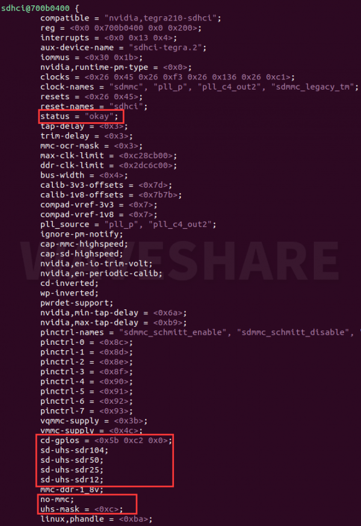

# Prepare Nvidia Jetson Nano 4GB as a CCTV camera for Floating Litter Detection

### Requirements
    - Nvidia Jetson Nano 4GB Dev Kit
    - SD card (> 32GB)
    - USB Camera
Other peripherals, please refer to [components](./List-of-Components.md) for list of equipments we use to build the camera setup.

## Part 1: Install OS and boot from TF card

### Method 1

If have original Nvidia Jetson Nano 4GB (b01) dev kit, download the [SDcard image](https://developer.nvidia.com/jetson-nano-sd-card-image), flash SDcard with the downloaded image. (Use [balena etcher](https://www.balena.io/etcher/) for flashing.) For more details, refer to [https://developer.nvidia.com/embedded/learn/get-started-jetson-nano-devkit](https://developer.nvidia.com/embedded/learn/get-started-jetson-nano-devkit).

### Method 2

If you have Alternative module, follow below steps. [adapted from waveshare] https://www.waveshare.com/wiki/JETSON-NANO-DEV-KIT#Method_1:_Copy_the_system_directly_on_eMMC

#### Requirements
    - Ubuntu 18.04 host system to flash the jetson nano

Open the terminal on the ubuntu virtual machine or host and create a new folder
    sudo mkdir sources_nano
    cd sources_nano 

Download path
    sudo wget https://developer.nvidia.com/embedded/l4t/r32_release_v7.2/t210/jetson-210_linux_r32.7.2_aarch64.tbz2
    sudo wget https://developer.nvidia.com/embedded/l4t/r32_release_v7.2/t210/tegra_linux_sample-root-filesystem_r32.7.2_aarch64.tbz2

Unzip resource
    sudo tar -xjf Jetson-210_Linux_R32.7.2_aarch64.tbz2
    cd Linux_for_Tegra/rootfs/       
    sudo tar -xjf .. /.. /Tegra_Linux_Sample-Root-Filesystem_R32.7.2_aarch64.tbz2
    cd .. /
    sudo ./apply_binaries.sh (If an error occurs, follow the prompts and re-enter the instruction). 

The defualt image does not detects the SD card slot on the Jetson Nano (only in alternative or sub version). We need to change the tree files to enable it. Install the DTC software on the virtual machine.

sudo apt-get install device-tree-compiler

    cd sources_nano/Linux_for_Tegra/kernel/dtb
    dtc -I dtb -O dts -o tegra210-p3448-0002-p3449-0000-b00.dts tegra210-p3448-0002-p3449-0000-b00.dtb

    sudo nano tegra210-p3448-0002-p3449-0000-b00.dts

Find the sdhci@700b0400 section, change status = "disable" to okay, and add TF information below.

    cd-gpios = <0x5b 0xc2 0x0>;
    sd-uhs-sdr104;
    sd-uhs-sdr50;
    sd-uhs-sdr25;
    sd-uhs-sdr12;
                
    no-mmc;
    uhs-mask = <0xc>; 

It should show like below after the edits.

Compile dtb files.

    dtc -I dts -O dtb -o tegra210-p3448-0002-p3449-0000-b00.dtb tegra210-p3448-0002-p3449-0000-b00.dts

Programming system, Jetson Nano needs to enter recovery mode (addthe jumper cap) and connect to the Ubuntu computer using the USB.

    cd sources_nano/Linux_for_Tegra
    sudo ./flash.sh jetson-nano-emmc mmcblk0p1

Unplug the cable and jumper cap. Power the Jetson Nano with adapter and its starts booting.
After booting check if the SD card is detected or not. Follwoing steps are to be run from the jetson.

    sudo ls /dev/mmcblk*

If the mmcblk1p1 device is recognized, the SD card is recognized normally.
    

Format the SD card.
    sudo mkfs.ext4 /dev/mmcblk1

If a file system is already available, Unmount the SD card firstand then Format the SD card again using the format command.

    sudo umount /media/ (here press the Tab key to complete automatically).
    sudo mkfs.ext4 /dev/mmcblk1

After successful formatting, enter the following command, and there should be only one mmcblk1.
    
    sudo ls /dev/mmcblk* 

Modify the startup path.
    
    sudo vi /boot/extlinux/extlinux.conf

Find the statement APPEND ${cbootargs} quiet root=/dev/mmcblk0p1 rw rootwait rootfstype=ext4 console=ttyS0,115200n8 console=tty0, modify mmcblk0p1 to mmcblk1 to save.

Mount the SD card.
    
    sudo mount /dev/mmcblk1 /mnt

Copy the system to the SD card (the process has no information to print, please wait patiently).
    
    sudo cp -ax / /mnt

After the copy is complete, uninstall the SD card (not unplug the SD card).

    sudo umount /mnt/

Restart the system.
    
    sudo reboot

open the terminal, enter df -h to check the disk size and to check if the system is booting from SD card.

## Part 2: Install CUDA and PyTorch 

Get and update pip

    sudo apt update
    sudo apt install -y python3-pip
    pip3 install --upgrade pip

Install some dependencies

    sudo apt install -y libfreetype6-dev libjpeg-dev libopenblas-dev libopenmpi-dev libomp-dev zlib1g-dev

Check if CUDA available,

    nvcc -V

If CUDA not available, either use SDK manager from Nvida to install or run below. This step might be skipped if using board is official module.

    sudo apt install nvidia-jetpack

    echo $'export PATH="/usr/local/cuda/bin:${PATH}"' >> ~/.bashrc
    echo $'export LD_LIBRARY_PATH="/usr/local/cuda/lib64:${LD_LIBRARY_PATH}"' >> ~/.bashrc

Install PyTorch from below wheel

    wget https://nvidia.box.com/shared/static/fjtbno0vpo676a25cgvuqc1wty0fkkg6.whl -O torch-1.10.0-cp36-cp36m-linux_aarch64.whl
    pip3 install torch-1.10.0-cp36-cp36m-linux_aarch64.whl

    git clone --branch v0.11.1 https://github.com/pytorch/vision torchvision
    cd torchvision
    sudo python3 setup.py install
    cd ..

Test if PyTorch working with CUDA

    python3 -c 'import torch; print(torch.cuda.is_available())'

## Setting up pLitterCCTV + Yolov5 + StrongSort

Clone the cctv branch from plitter repo

    git clone -b cctv --recurse-submodules https://github.com/gicait/plitter
    cd plitter
    pip3 install -r requirements.txt

Update the details for camera configuration. Change the variable vavalues in [camera_config.env](../camera_config.env) and [cctv_secret.env](../cctv_secret.env), this information is necessary to uplaod the captured images and detections to the cloud.

Before you run the follow step, make surem a USB camera is plugged and device is connected to internet.

    sudo chmod +x start.sh
    ./start.sh

Check logs/ folder for logs. In case of erros follow the prompts, solve and run agian. If No errors your system is ready to deploy, add this to crontab to start at system boot up.

    # with tracker
    @reboot path_to_plitter/start.sh
    # without tracker
    @reboot path_to_plitter/start_cctv.sh

